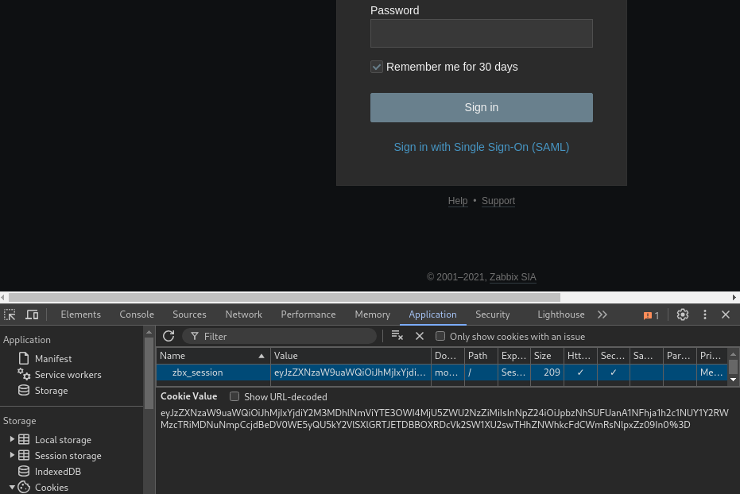

# CVE-2022-23131 Zabbix SAML Authentication Exploit

This Python script exploits a misconfigured SAML authentication flow on a Zabbix server. By providing a Zabbix server URL and a user (default: `Admin`), the script generates an authenticated Zabbix session (`zbx_session`), and attempts to access the dashboard with the authenticated session.


## Usage

To use the script, run it from the command line and provide the target Zabbix server URL. You can optionally specify a user and a custom user agent.

### Basic Usage

```
python cve-2022-23131.py <target_url>
```


### Optional Parameters

- **`-u` or `--user`**: Specify the Zabbix user to authenticate as (default: `Admin`).
- **`-a` or `--user-agent`**: Provide a custom User-Agent string.

### Examples

1. **Run the exploit with default parameters**:

```
python cve-2022-23131.py https://zabbix.local
```

2. **Run the exploit with a custom user**:
```
python cve-2022-23131.py https://zabbix.local -u JohnDoe
```

3. **Run the exploit with a custom User-Agent**:
```
python cve-2022-23131.py https://zabbix.local -u JohnDoe -a "CustomUserAgent/1.0"
```


## Output

The script will indicate whether the exploit was successful. If successful, it will print an authenticated `zbx_session`, which you can use to access the Zabbix dashboard.

Here’s an example of the script in action:


## How to Update the Cookie in Chrome or Firefox

Once you have successfully retrieved the `zbx_session` value, you can manually update the cookie in your browser to authenticate yourself as the specified user. Follow the steps below for **Chrome** or **Firefox**.

### Chrome

1. Open Chrome and go to the Zabbix server URL.
2. Right-click on the page and select **Inspect** to open the Developer Tools.
3. Go to the **Application** tab.
4. In the left-hand pane, under **Storage**, click **Cookies**, and select the Zabbix server URL.
5. Find the **`zbx_session`** cookie.
6. Double-click the **Value** field, replace it with the newly generated `zbx_session` value, and press Enter.

### Firefox

1. Open Firefox and go to the Zabbix server URL.
2. Right-click on the page and select **Inspect Element** to open the Developer Tools.
3. Go to the **Storage** tab.
4. In the left-hand pane, click on **Cookies**, and select the Zabbix server URL.
5. Find the **`zbx_session`** cookie.
6. Double-click the **Value** field, replace it with the new `zbx_session` value, and press Enter.

Here is an example of how to update the cookie in the Developer Tools:




## Credits

Credits for this exploit write-up go to @random-robbie, @jweny, and @Mr-xn. I just modified the script as I found it wasn't working as expected anymore.

Reference: [https://github.com/Mr-xn/cve-2022-23131](https://github.com/Mr-xn/cve-2022-23131)
